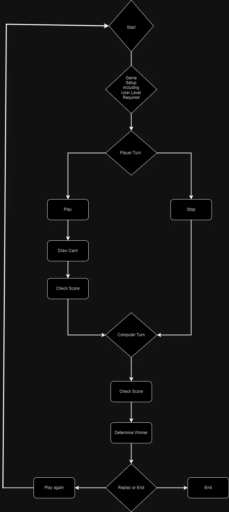
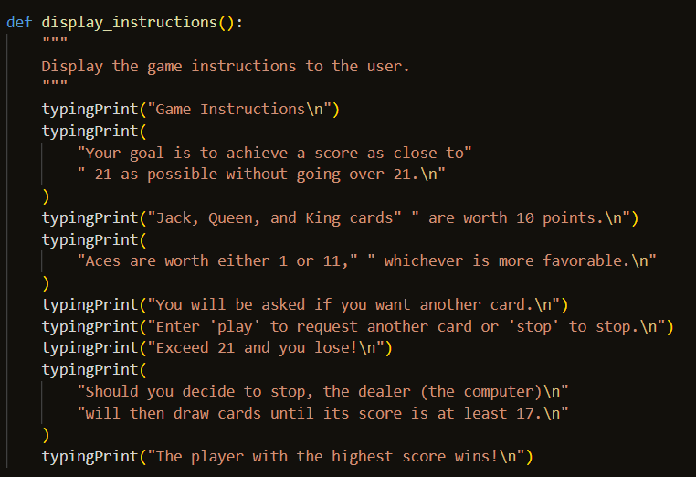
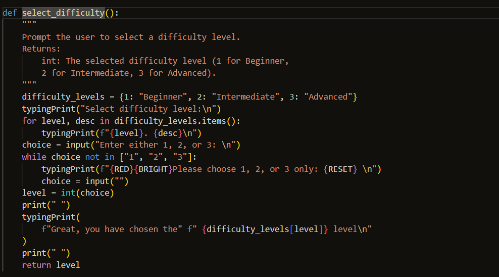
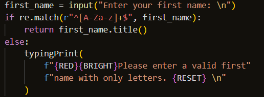
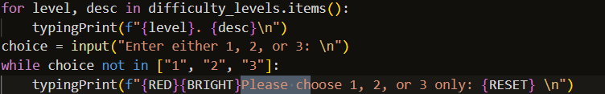
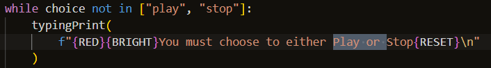
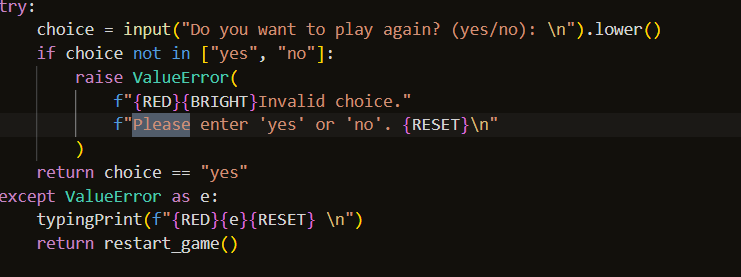
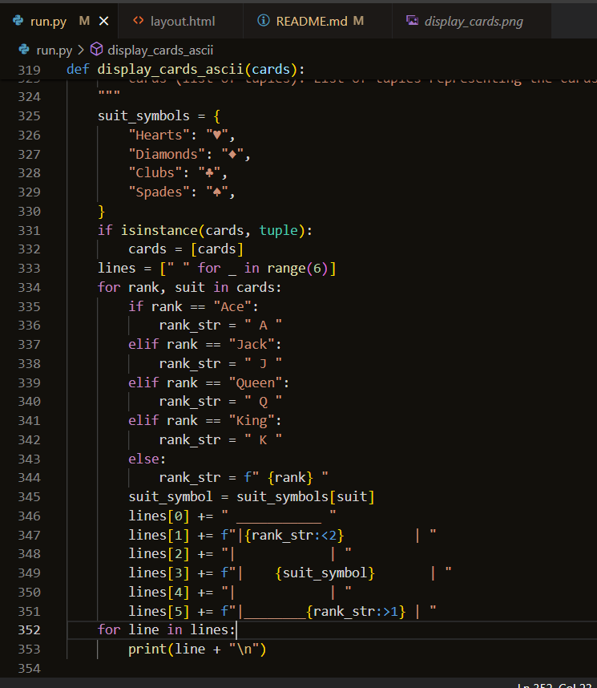
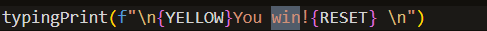
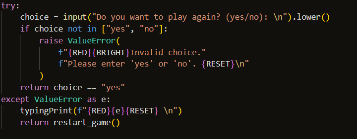

# Blackjack

Blackjack, also known as 21, is a popular card game played worldwide by people of all ages. 
The objective is simple: players aim to beat the dealer's hand without going over the value of 21. 
In this Python-based Blackjack game, players are interacting with the dealer(Computer Dealer). 

The game starts by prompting the player to select a difficulty level, then dealing cards to both the player and the computer. 
The Player can choose to draw additional cards ("hit") or stop drawing ("stand") to try and achieve a score as near to 21 in order to beat the Computer. The computer dealer follows a set of rules based on the chosen difficulty level, adding an element of strategy to the game. 

Once the player decides to stop drawing cards, the computer takes its turn, and the winner is determined based on the total scores of both the player and the computer. This Blackjack game offers an entertaining and challenging experience for players of all skill levels.

This project was built with Python3 as the "Python's Essentials" Project (portfolio project 3) for Code Insitute. 

[Link to live site](https://blackjack-ng-941132ac49c5.herokuapp.com/)


## Index - Table of Contents

- [Planning](#planning)

- [Design](#design)

- [UX](#ux)
    - [Programm Goals](#programm-goals)
    - [User Stories](#user-stories)

- [Features](#features)
    - [Existing Features](#existing-features)
    - [Future Features](#possible-future-features)

- [Data Model](#data-model)

- [Testing](#testing)
    - [Validator Testing](#validator-testing)
    - [Browser Testing](#browser-testing)
    - [Testing User Stories](#testing-user-stories-functionality)

- [Debugging](#debugging)
    - [Fixed bugs](#fixed-bugs)
    - [Unfixed bugs](#unfixed-bugs)

- [Deployment](#deployment)

- [Credits](#credits)
    - [Data](#data)
    - [Code](#code)
    - [Styling](#styling)

<br>

## Planning

The following flowchart (created with [daigrams.net](https://app.diagrams.net/)) visualizes the planning process for this application.



<br>

## How the Game Works

### Game Flow

#### Welcome Screen
When the game starts, players are greeted with a welcome screen where they can enter their first name to personalize their experience.


#### Game Setup
Players have the option to view high scores, choose the difficulty level (Beginner, Intermediate, Advanced), and view game instructions if needed.

#### Gameplay
The player and the computer dealer are each dealt two cards from a standard deck of 52 playing cards.
The player can choose to "play" (request another card) or "stop" (finish their turn).
If the player's score exceeds 21, they lose the game.
After the player's turn, the computer dealer draws cards until its score is at least 17.
If the computer's score exceeds 21, the player wins.
Otherwise, the player with the highest score (not exceeding 21) wins the round.


#### Difficulty levels

- Beginner Level:
The computer opponent draws cards until its score reaches 17 or higher, regardless of the player's score or the game state.

<br>

- Intermediate Level:
The computer opponent draws cards until its score reaches 17 or higher, similar to the beginner level. However, it may also consider the player's score and adjust its strategy slightly based on the current game state. For example, if the player's score is high, the computer may be slightly more aggressive in drawing additional cards.

<br>

- Advanced Level:
The computer opponent employs more sophisticated strategies based on statistical analysis and dynamic decision-making. It evaluates the player's score, the current game state, and possibly other factors to determine the optimal decision for each turn. This could involve adjusting its threshold for drawing cards, taking calculated risks, or implementing advanced strategies to increase its chances of winning.

<br>

#### Scoring
The player's score is compared against the computer's score, and the winner earns points based on the difficulty level.
The player's name, score, and difficulty level are recorded in a Google Sheets document.

#### End of Game
Players have the option to play again or exit the game.
If they choose to play again, they can continue with the same username and have the option to choose a new difficulty level or choose the level that they had initially chosen.

## UX

### Program Goals

The goal of this program is to provide the user with a simple, easy to understand and play game of hangman that can be played multiple times without the challenge being repeated.

### User Stories

*** As a user I want to ***

#### New User Goals:
- Learn how to play the game efficiently.
- Understand the game rules and mechanics.
- Enjoy a user-friendly interface for a smooth gaming experience.
- Easily navigate through the game's features and options.
- I want to view the high scores of previous players so that I can gauge how well I perform compared to others.
- I want the option to restart the game after finishing a round so that I can play again without having to reload the game.

#### Frequent User Goals:
- Master the strategies required to win the game consistently.
- Explore different difficulty levels to challenge their skills.
- Engage in competitive gameplay against the computer.
- Provide feedback and suggestions for improving the game's features and usability.
- I want the option to view the high scores easily accessible from the main menu so that I can check my progress or compare scores with others.

#### Returning User Goals:
- Explore any updates or improvements made to the game since their last play session.
- Challenge themselves with different difficulty levels to enhance their skills.
- Compete against the computer to achieve higher scores and improve their strategy.
- Provide feedback on their experience to help shape future updates and optimizations.

<br>

## Features

### Existing Features

#### Logo
- Displays game title using ASCII


#### Personalization
The game welcomes players by their first name, creating a personalized experience.

#### Google Sheets Integration
Scores are stored and updated in a Google Sheets document, allowing players to track their performance over time.

#### Instructions 
- Gives the user a brief run through the game and how to play it. The option to view the instructions is presented when the player first begins the game, if the player decides to play again then they are not asked if they would like to view the instructions.



#### View High Scores 
- Gives the user the option to view the Top 10 High Scores, who score them and what level they were achieved at.  This option is presented to the player for their initial game, it may aid the player in choosing a particular level to play the game at.  The option to view the high scores is not presented to the player should they decide to play again after the initial game ends.


#### Level choice
- Allows user to choose one of three difficulty levels (Beginner, Intermediate or Advanced).  The player is asked to choose from the three levels on offer both when they start the game for the first time and if they decide to play again, the rationale behind the player being given this option if they decide to play again is that the player may like to play the next game at a different level than the level chosen for the initial game.



#### Invalid Data Error
- Informs the user if input data was not valid
- Tells the user which data type is required and what was typed incorrectly
- Displays for invalid level and letter input

##### invalid name: 


##### invalid level: 


##### invalid stop or play chosen:


##### invalid play again:


##### invalid view high scores:


##### invalid view instructions:


#### Cards Drawn display
- Shows the Cards the player has drawn both in ascii and in text.




#### Game won message
- Informs the player when they have won 



#### Game lost message 
- Informs player when they have lost


#### It's a Tie message 
- Informs player when they have scored the same score as the computer.


#### Restart Game option
- Offers user the choice to play again after finishing the game


### Possible Future Features

**Username recogition**
- When a returning user logs in they are asked if they would like to play at the level that they played before.

<br>

## Data Model


*Data Validation*

To make use of my learned knowledge of the ```try``` and ```except``` statements, I used the opportunity to apply these statements to various points where errors could occur during gameplay, such as card drawing, player input, or updating scores. Wrapping the at risk sections of code with try and except blocks, provides a method of handling unexpected exceptions that may arise and ensure the appropriate feedback is displayed  to the user without crashing the program where applicable.  Some examples of the ```try```and ```except``` statements used are as follows:

### Error Handling during Score Update

In the update_scores() function, we rely on a dependable connection with external resources (Google Sheets) to update the scores. There are several opportunities for failure that may occur during this process, such as network errors, authentication issues, or unexpected data format. By using a try and except block, we can catch any exceptions that occur during the update process and handle them gracefully. Thus preventing the program from crashing and subsequently providing informative error messages to the user.


#### Error Handling on Restart Game 
In the restart_game() function, the player is prompted for their input choice on whether they want to play again or not. If the player enters an invalid choice (i.e., neither "yes" nor "no"), this may raise a ValueError. By using a try and except block, this specific exception is caught and a prompt is displayed to the player to enter a valid choice, ensuring smooth interaction with the game.



<br>

## Testing

### Validator Testing

- HTML, CSS and JavaScript validation does not apply to this project. The template provided by Code Institute as provided to all students is assumed to be tested for the above.
No further change or manipulation of the template's default HTML, CSS and JavaScript files has been performed.

- Python Validator [PEP8](https://pep8ci.herokuapp.com/#)

    

- Performance, Accessibility, SEO, Best Practices (Lighthouse Chrome DevTools)

    

    As SEO was not an objective of this particular project, I chose to be content with a rating that is barely below 90. 

<br>

### Browser Testing

Ensuring all parts of the programm function as expected in all major browsers.

| Browser                 | Layout        |  Functionality |
| :--------------------:  | :-----------: |  :-----------: |
| Chrome                  | ✔             | ✔             |
| Edge                    | ✔             | ✔             |
| Firefox                 | ✔             | ✔             |
| Safari                  | ✔             | ✔             |
| Avast Secure Browser    | ✔             | ✔             |

<br>

### Testing User Stories (Functionality)

| Expectation (As a user, I want to...)                                              | Result (As a user, I...)    |
| :--------------------------------------------------------------------------------: | :------------------------------:|
| be given the option to view the high scores after I enter my username the programm | I can see the option to view the highscores following entry of my username |
| be given the option to view the game instructions                                  | I am presented with the option to view to instructions |
| choose a difficulty level | can choose between 3 levels: Beginner, Intermediate, Advanced |
| be informed if my data input is not valid and why                                  | see an error message after I input invalid data, telling me what data type is required 
| know when the game is over and who has won and what the score was for me as a player or the computer | can read a message telling me I either won or the computer won and what the scores were for me and for the computer the game when the game terminates |
| be able to choose to play the game again when it's finished | can choose between a Yes or No option to play the game again after finishing |

<br>

## Debugging

### Fixed Bugs

**Formatting**

To guarantee consistent line breaks, whitespaces and indentation, run.py was formatted using [Black Playground](https://black.vercel.app/)


### Unfixed Bugs

Despite the known bug that allows users to input text while the game's text is displayed, the captivating visual effects and enhanced gameplay experience offered to the player outweigh this minor inconvenience. The engaging card displays, accompanied by clear instructions, significantly enhance the game's appeal and provide players with an immersive blackjack experience. While the bug may disrupt the flow slightly, its impact is minimal compared to the overall enjoyment and entertainment value provided by the game.

Addressing this bug on Gitpod and Heroku presents a difficult challenge due to the remote execution environments and limitations on direct user interaction with the terminal. The complexity of the bug and its resolution are further impacted by how these platforms handle user input and terminal display, making it non-trivial to resolve without compromising other aspects of the application's functionality.

<br>

## Deployment

This project was deployed with Heroku using Code Institute's mock terminal as provided with the Python Essentials template.

To deploy:

- Clone or fork this public repository
- Create a Heroku account (if not already existing)
- Create a new app with Heroku
- In **Settings**, add 2 buildpacks:
    - ```Python```
    - ```NodeJS```
    
    Ensure the buildpacks are created in that order!

- Allowing Heroku access to GitHub, link the new app to the relevant repository
- Choose whether or not to enable **Automatic Deploys**. If enabled, the deployed app will update automatically with each push to GitHub
- Click **Deploy**

<br>

## Credits

### Data

- **High Scores**: 

    [High Scores Google Sheet](https://docs.google.com/spreadsheets/d/1r9CzTp2wzx3XwvAnAsxe9T_BxKYqw-b7Ls7j1tiDSro/edit#gid=0)

- **Logo**:

    [Blackjack Logo](https://replit.com/@PaulCross/blackjack-start#art.py)

   
### Code

- **Template and Terminal**

    [Python Essentials Template](https://github.com/Code-Institute-Org/python-essentials-template) provided by Code Institute 

- **Python Typing Effect**
    [Python Typing Effect](https://www.101computing.net/python-typing-text-effect/)


### Styling

- **Colours**

    Built-in module [Colorama](https://github.com/techwithtim/ColoredTextInPython/blob/main/main.py)

- **Timing**

    [time module](https://www.freecodecamp.org/news/the-python-sleep-function-how-to-make-python-wait-a-few-seconds-before-continuing-with-example-commands/#:~:text=Make%20your%20time%20delay%20specific,after%20a%20slight%20delay.%22) and sleep() function